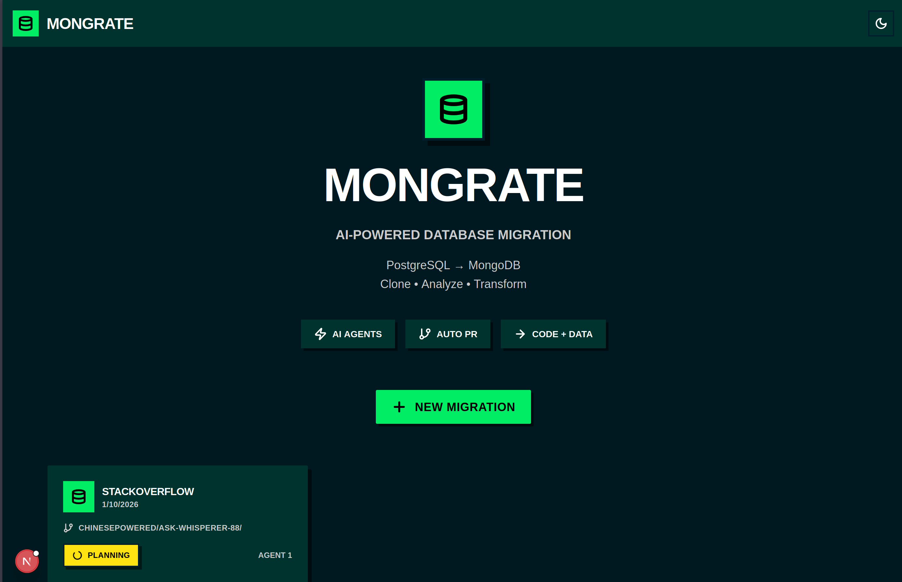

# Mongrate

**AI-Powered Database Migration from PostgreSQL to MongoDB**

Mongrate is an intelligent migration platform that automates the process of migrating applications from PostgreSQL to MongoDB. Using AI agents powered by Claude, it analyzes your codebase, creates migration plans, transforms your schema and queries, and even generates pull requests with the changes.

## ✨ Features

- 🤖 **AI-Powered Analysis** - Claude AI agents analyze your codebase and database schema
- 🔄 **Automated Migration** - Automatic code transformation from PostgreSQL to MongoDB
- 🎯 **Smart Schema Mapping** - Intelligent conversion of relational schemas to document models
- 🌿 **Auto PR Creation** - Generates pull requests with migrated code on a new branch
- 📊 **Real-time Progress** - Track migration status with live updates
- 💬 **Interactive Chat** - Communicate with AI agents during the migration process
- 🎨 **Modern UI** - Clean, accessible interface with dark mode support

## 🚀 Getting Started

### Prerequisites

- Node.js 18+ and npm/pnpm
- MongoDB Atlas account (or local MongoDB instance)
- GitHub account and personal access token (for repository cloning and PR creation)
- PostgreSQL database credentials (for source data migration)

### Installation

1. Clone the repository:

```bash
git clone https://github.com/AndresNinou/mongodb_hackathon.git
cd nextjs-template-mongodb
```

2. Install dependencies:

```bash
npm install
# or
pnpm install
```

3. Create a `.env.local` file in the project root:

```bash
cp .env.example .env.local
```

4. Add your MongoDB connection string to `.env.local`:

```env
MONGODB_URI=mongodb+srv://<username>:<password>@<cluster-url>/<database>?retryWrites=true&w=majority
```

### Development

Start the development server:

```bash
npm run dev
# or
pnpm dev
```

Open [http://localhost:3000](http://localhost:3000) to see the application.

## 📖 How It Works

### 1. Create a Migration

Click "New Migration" and provide:
- **Name**: A descriptive name for your migration
- **GitHub Repository URL**: The repo containing your PostgreSQL application
- **Branch** (optional): Target branch (defaults to main)
- **PostgreSQL URL**: Connection string for your source database
- **MongoDB URL**: Connection string for your target database
- **GitHub Token**: Personal access token for cloning and PR creation

### 2. Planning Phase

The AI agent will:
- Clone your repository
- Analyze the codebase structure
- Identify PostgreSQL queries and schema definitions
- Create a comprehensive migration plan
- Map relational tables to MongoDB collections

### 3. Execution Phase

Once you approve the plan:
- Code is automatically transformed
- PostgreSQL queries are converted to MongoDB operations
- Schema is migrated to document model
- Data is transferred from PostgreSQL to MongoDB
- Changes are committed to a new branch

### 4. Review & Deploy

- Review the generated pull request
- Test the migrated code
- Merge when ready

## 🛠️ Configuration

### Cross-Origin Development

The application is configured to work with tunneling services like ngrok:

```typescript
// next.config.ts
allowedDevOrigins: ['*']
```

This allows you to access your development server through ngrok or other tunneling services without CORS issues.

### Environment Variables

| Variable | Description | Required |
|----------|-------------|----------|
| `MONGODB_URI` | MongoDB connection string | ✅ Yes |

Per-migration configuration (provided through UI):
- `repoUrl`: GitHub repository URL
- `branch`: Target branch name
- `postgresUrl`: PostgreSQL connection string
- `mongoUrl`: MongoDB connection string
- `githubToken`: GitHub personal access token

## 🏗️ Project Structure

```
nextjs-template-mongodb/
├── app/
│   ├── api/
│   │   └── migrations/          # Migration API endpoints
│   ├── page.tsx                 # Main application page
│   └── layout.tsx               # Root layout
├── components/
│   ├── migration/               # Migration UI components
│   │   ├── MigrationCard.tsx
│   │   ├── MigrationDetail.tsx
│   │   ├── AgentChatPanel.tsx
│   │   └── CreateMigrationModal.tsx
│   ├── layout/                  # Layout components
│   └── ui/                      # Reusable UI components
├── lib/
│   ├── db/                      # Database utilities
│   ├── services/                # Business logic
│   │   └── migration/
│   │       ├── orchestrator.ts  # Migration orchestration
│   │       └── sessionManager.ts
│   └── agents/                  # AI agent prompts
├── types/                       # TypeScript type definitions
└── data/                        # Migration data and cloned repos
```

## 🎨 Tech Stack

- **Framework**: [Next.js 15](https://nextjs.org/) (App Router)
- **Language**: TypeScript
- **Database**: [MongoDB](https://www.mongodb.com/) with MongoDB Node.js Driver
- **AI**: [Claude AI](https://www.anthropic.com/claude) (Anthropic API)
- **Styling**: Tailwind CSS with custom brutal/neo-brutalist design
- **UI Components**: Custom components + [Lucide Icons](https://lucide.dev/)

## 🔐 Security Notes

- Never commit `.env.local` or expose sensitive credentials
- Use environment variables for all secrets
- GitHub tokens should have minimal required permissions
- Consider using read-only database connections for analysis phase

## 📚 Learn More

### MongoDB Resources
- [MongoDB Documentation](https://www.mongodb.com/docs/)
- [MongoDB Node.js Driver](https://www.mongodb.com/docs/drivers/node/current/)
- [MongoDB Atlas](https://www.mongodb.com/atlas)

### Next.js Resources
- [Next.js Documentation](https://nextjs.org/docs)
- [Learn Next.js](https://nextjs.org/learn)
- [Next.js API Routes](https://nextjs.org/docs/app/building-your-application/routing/route-handlers)

### AI Resources
- [Anthropic Claude API](https://docs.anthropic.com/)
- [Prompt Engineering Guide](https://www.promptingguide.ai/)

## 🤝 Contributing

Contributions are welcome! Please feel free to submit a Pull Request.

## 📄 License

This project is part of the MongoDB Hackathon submission.

## 🏆 MongoDB Hackathon 2026

Built for the MongoDB Hackathon as a demonstration of AI-powered database migration capabilities.

**Team**: AndresNinou  
**Project**: Mongrate - AI Database Migration Platform

---

**Powered by Claude • MongoDB • Next.js**
